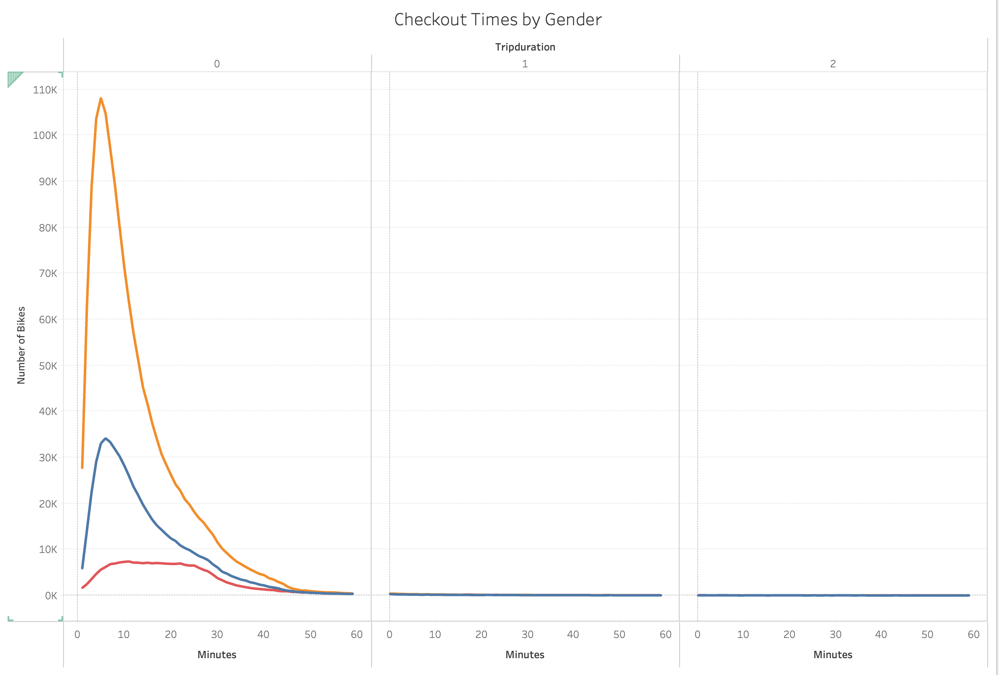
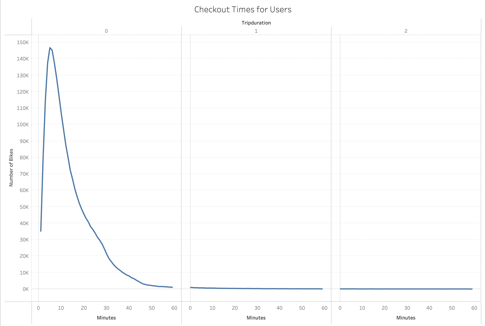
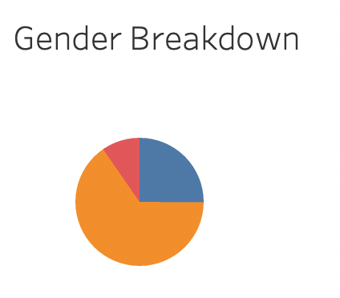
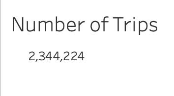

# Module 14
[Link to Dashboard](https://public.tableau.com/app/profile/amy.twilegar/viz/Module14_16577636110890/UserTripsbyGenderbyWeekday)
## Overview
The purpose of this analysis was to analyze different dimensions of the bike ride dataset. These dimensions include number of rides, time of ride, duration of ride, and gender.

## Results

Males are most represented here.

Most rides have a shorter duration.

There are more males than other genders (over 75%!).

There are about 2.3M trips in this data set.

Most trips occur during rush hour (8am and 5pm) during weekdays. Weekends have a more uniform distribution during waking hours (9am to 5pm).

The overall cyclical pattern by time of day is consistent between men and women.

Male subscribers are by far the largest represented group here.

## Summary
Overall, male subscribers are best represented group.
I would recommend two additional visualizations for further analysis:
1. Male subscribers vs. female subscribers number of rides by weekday vs. weekend
2. Overall number of rides by weekday vs. weekend
